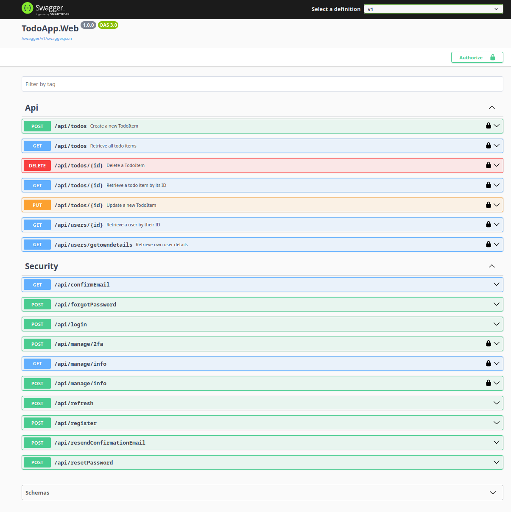

# Dotnet Core minimal Clean Architecture
## Super Enterprise Todo App™ 

Frontend for this project can be found here:

https://github.com/Avicted/todo_app_vite_react_frontend

### Work in progress !
- Tests are missing

# Run the project

```bash
# Update/Seed database from within the Web project
cd TodoApp.Web
dotnet ef database update --context ApplicationDbContext --project ../TodoApp.Infrastructure/TodoApp.Infrastructure.csproj --startup-project TodoApp.Web.csproj

# Go back to the project root
cd ..
./start.sh
```

Open the swagger page:

[http://localhost:1337/swagger](http://localhost:1337/swagger)


# Swagger



###  Deal with any new Warnings
```bash
dotnet list package --outdated

# Update packages
dotnet add package [PackageName] --version [LatestVersion]

# Implement the changes
```


### Any new Migration
```bash
# Creat a migration
dotnet ef migrations add <MigrationName> --startup-project  TodoApp.Web/TodoApp.Web.csproj --project TodoApp.Infrastructure/TodoApp.Infrastructure.csproj

# Update/Seed database from within the Web project
cd TodoApp.Web
dotnet ef database update --context ApplicationDbContext --project ../TodoApp.Infrastructure/TodoApp.Infrastructure.csproj --startup-project TodoApp.Web.csproj

```


#### Initial setup, already done for documentation purposes
```bash
# From project root

# Add packages to the projects
cd TodoApp.Web 
dotnet add package Microsoft.EntityFrameworkCore
dotnet add package Microsoft.EntityFrameworkCore.Design
dotnet add package Swashbuckle.AspNetCore.Swagger
dotnet add package Swashbuckle.AspNetCore
dotnet add package FastEndpoints
dotnet add package FastEndpoints.Swagger
dotnet add package FastEndpoints.Security


cd TodoApp.Infrastructure
dotnet add package Microsoft.EntityFrameworkCore.Sqlite
dotnet add package Microsoft.EntityFrameworkCore
dotnet add package Microsoft.EntityFrameworkCore.Design
dotnet add package Microsoft.AspNetCore.Identity
dotnet add package Microsoft.AspNetCore.Identity.EntityFrameworkCore
dotnet add package Microsoft.IdentityModel


cd TodoApp.UseCases
dotnet add package AutoMapper
dotnet add package FastEndpoints
dotnet add package Microsoft.AspNetCore.Authentication.JwtBearer


cd TodoApp.Core
dotnet add package Microsoft.AspNetCore.Identity
dotnet add package Microsoft.AspNetCore.Identity.EntityFrameworkCore
```